# jvma-nosql-social-network-api
API for a social network web application to share thoughts, react to friends' thoughts and create a friends list.

## Description

This was a Job-Seeking coding assessment, where I was required to build a Social Network API using JavaScript, Node.js, NPM, NoSQL (MongoDB), Mongoose package and Express.js package. This API allows, in one part, to create and update users, get all users, get user by id, delete users, add friends to a user's friend list and remove friends from it. It also lets users to create and update thoughts, get all thoughts, get thought by id, delete thoughts, add reactions to a thought and remove reactions from it. All this must be done using NoSQL, in this case MongoDB, in conjunction with an Object Document Mapper (Mongoose). 

To begin building the app, I started with the connection set up, importing Mongoose and connecting to MongoDB. Then I wrote the code for the server configuration, importing Express.js, setting the PORT, express middleware to parse URL encoded bodies as well as json, and listener function to listen for connections to the server. 

Next, I wrote the code for the User and Thought schemas (and models), as well as the Reaction schema (without creating a model from it). The userSchema sets a username (type: String), email (type: String), thoughts (array, type: ObjectId, with reference to "thought" model), friends (array, type: ObjectId, with reference to "user" model) and a virtual ("friendCount") to count the length of the friends array. The thoughtSchema sets thoughtText (type: String), createdAt (type: Date), username (type: String), reactions (array of nested documents which are created with the reactionSchema), and a virtual ("reactionCount") to count the length of the reactions array. On the other hand, the reactionSchema sets a reactionId (type: String), reactionBody (type: String), username (type: String) and createdAt (type: Date). For the thoughtSchema and reactionSchema I set up getter methods to format the dates, using a formatDate function (imported from utils/helpers.js).

Then, I proceeded with the code for the userController and thoughtController. In userController.js I defined the following functions, exporting them in an object: `getUsers()`, `getSingleUser()`, `createUser()`, `updateUser()`, `deleteUser()`, `addFriend()` and `deleteFriend`. For the thoughController.js I created these functions, also exporting them in an object: `getThoughts()`, `getSingleThought()`, `createThought()`, `updateThought()`, `deleteThought()`, `createReaction()` and `deleteReaction()`. 

Finally, I defined the API routes in userRoutes.js and thoughtRoutes.js. First, I imported all the functions from userController.js to userRoutes.js, then I set `router.route('/')` with GET to get all users and POST to create a user, `router.route('/:userId')` with GET to get a user by Id, PUT to update a user and DELETE to delete a user, and `router.route('/:userId/friends/:friendId')` with POST to add a friend to a user's friends list and DELETE to remove a friend. Following up, I imported all the functions from thoughtController.js to thoughtRoutes.js, after this I set `router.route('/')` with GET to get all thoughts and POST to create a thought, `router.route('/:thoughtId')` with GET to get a thought by Id, PUT to update a thought and DELETE to delete a thought, `router.route('/:thoughtId/reactions')` with POST to create a reaction, and `router.route('/:thoughtId/reactions/:reactionId')` with DELETE to remove a reaction from the reactions array of a thought.   

## Usage & [Walkthrough Video](https://drive.google.com/file/d/1OHdMh3Cfosf2mO7zPkqBerpgZ21a444V/view?usp=sharing)

To see the application in use watch this [Walkthrough Video](https://drive.google.com/file/d/1OHdMh3Cfosf2mO7zPkqBerpgZ21a444V/view?usp=sharing)

The application looks like this:

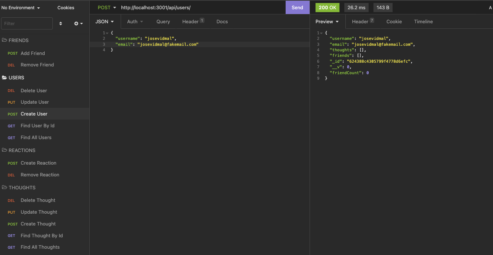

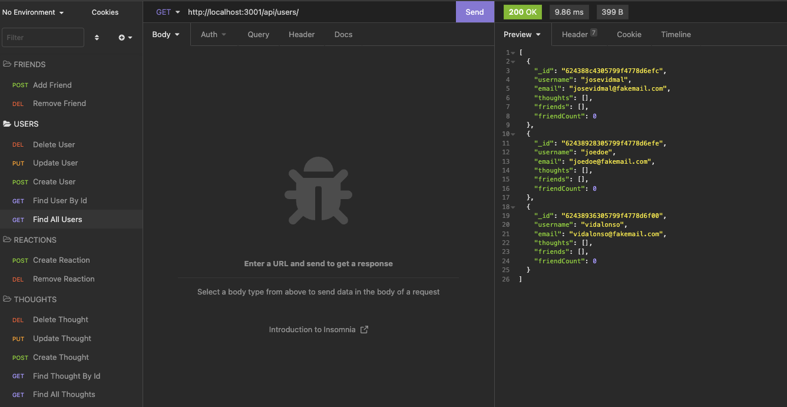

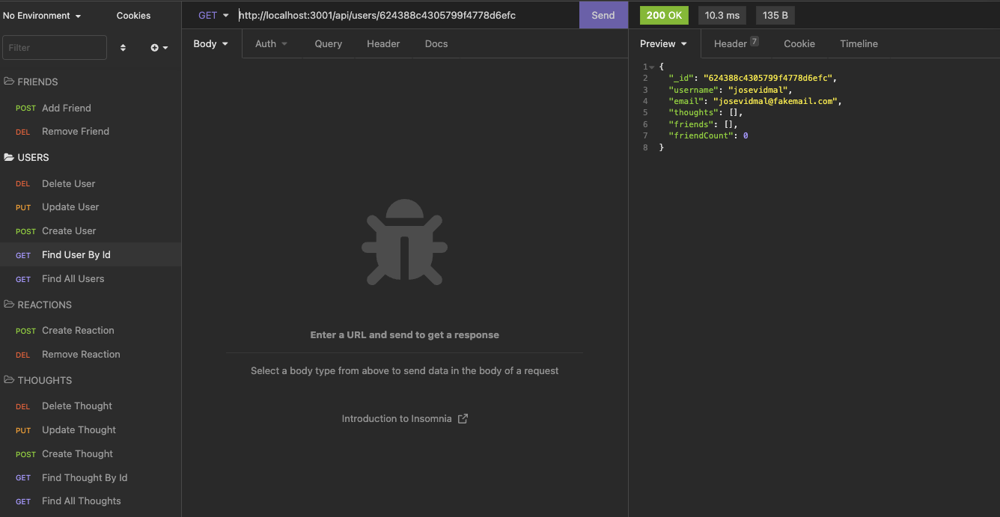

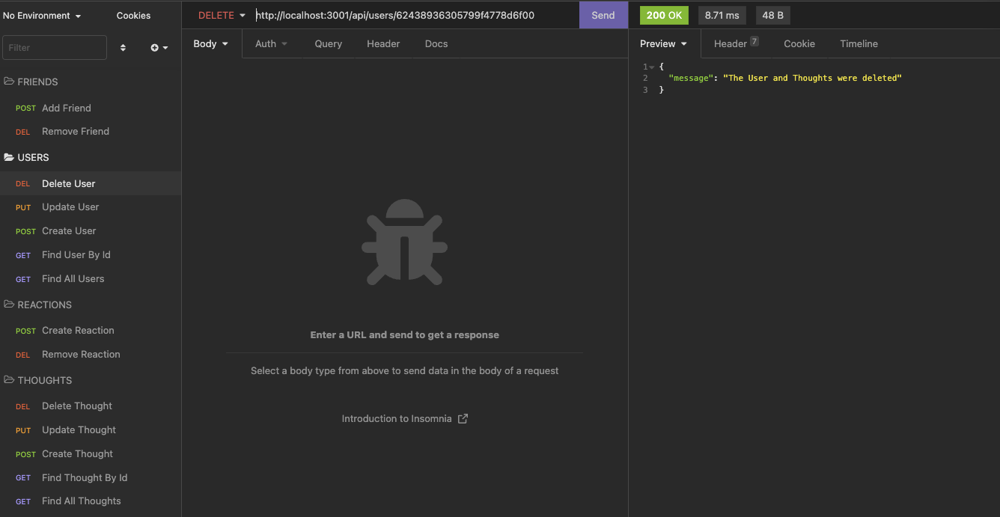 

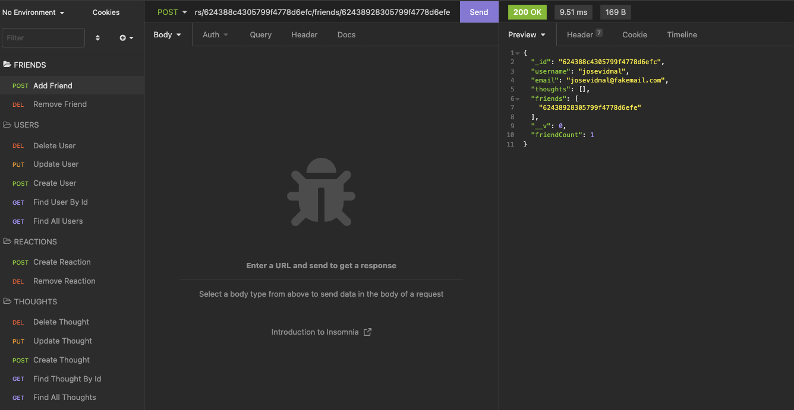

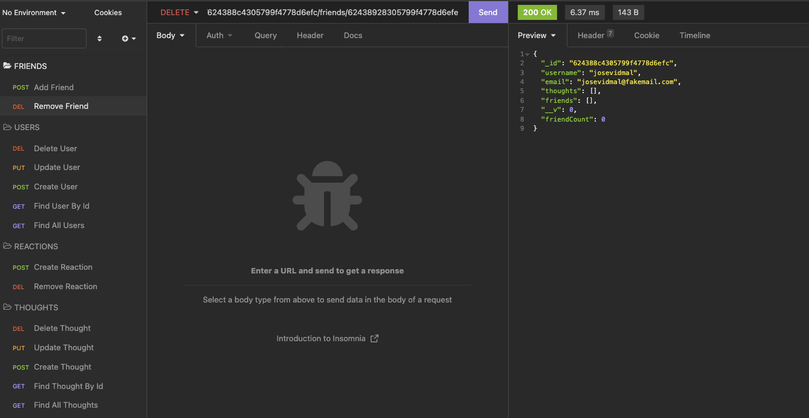

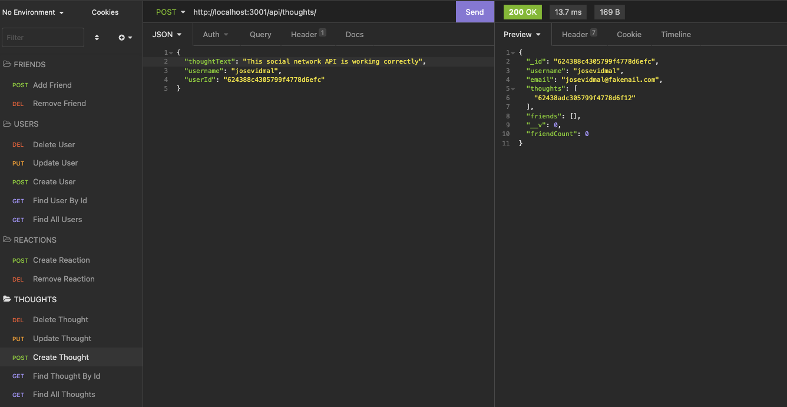

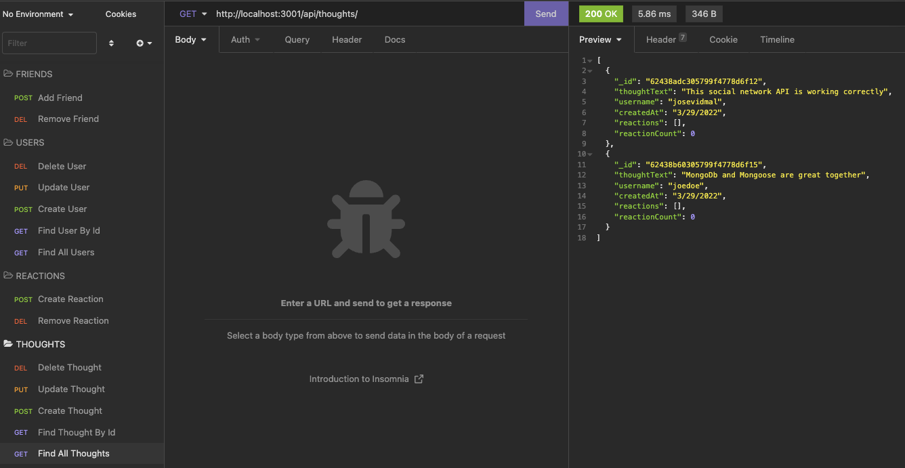

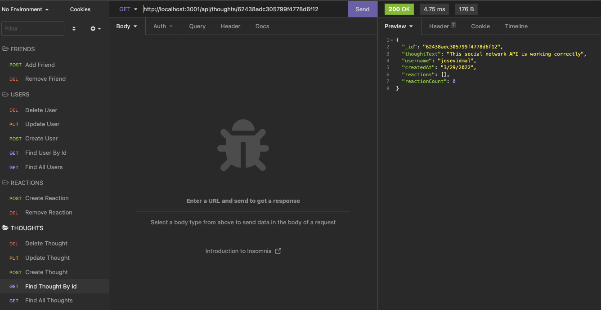

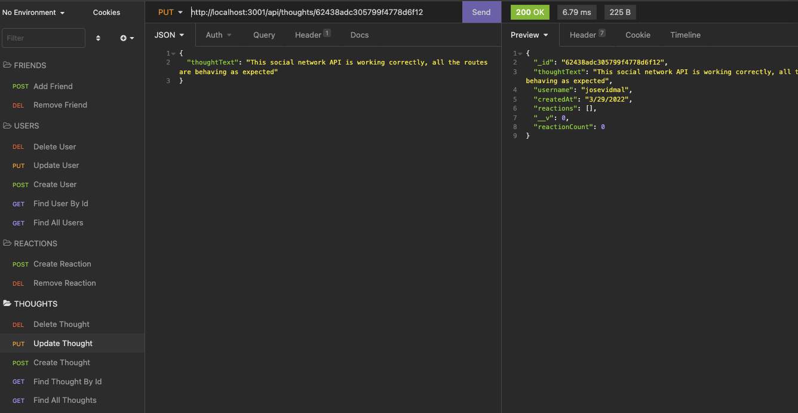

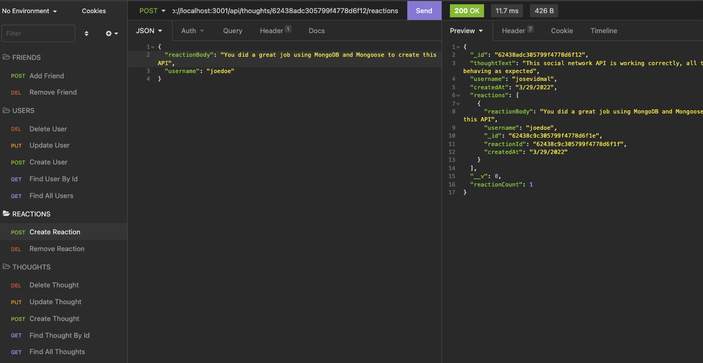

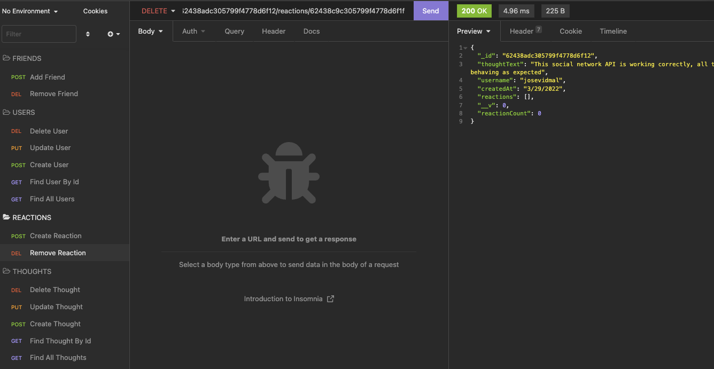

## Technologies Used

* JavaScript
* Node.js
* NPM
* MongoDB
* Mongoose package
* Object Document Mapping (ODM)
* Express.js package
* Insomnia

## Contact Information

* GitHub Profile: [josevidmal](https://github.com/josevidmal)
* email: josevidmal@gmail.com

## License

[The MIT License](https://www.mit.edu/~amini/LICENSE.md)

Copyright 2022 Jose Vidal

Permission is hereby granted, free of charge, to any person obtaining a copy of this software and associated documentation files (the "Software"), to deal in the Software without restriction, including without limitation the rights to use, copy, modify, merge, publish, distribute, sublicense, and/or sell copies of the Software, and to permit persons to whom the Software is furnished to do so, subject to the following conditions:
    
The above copyright notice and this permission notice shall be included in all copies or substantial portions of the Software.
    
THE SOFTWARE IS PROVIDED "AS IS", WITHOUT WARRANTY OF ANY KIND, EXPRESS OR IMPLIED, INCLUDING BUT NOT LIMITED TO THE WARRANTIES OF MERCHANTABILITY, FITNESS FOR A PARTICULAR PURPOSE AND NONINFRINGEMENT. IN NO EVENT SHALL THE AUTHORS OR COPYRIGHT HOLDERS BE LIABLE FOR ANY CLAIM, DAMAGES OR OTHER LIABILITY, WHETHER IN AN ACTION OF CONTRACT, TORT OR OTHERWISE, ARISING FROM, OUT OF OR IN CONNECTION WITH THE SOFTWARE OR THE USE OR OTHER DEALINGS IN THE SOFTWARE.